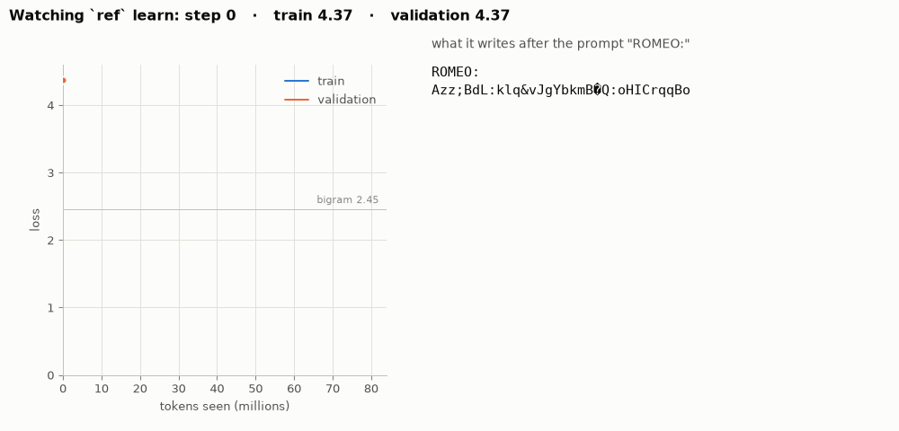
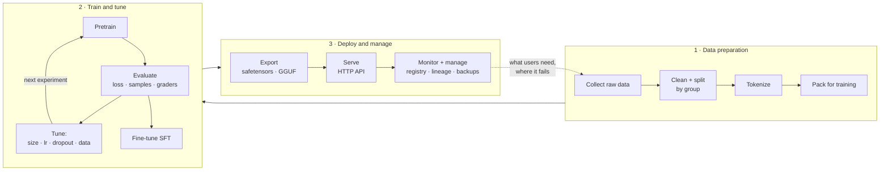
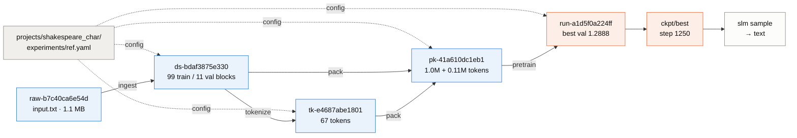
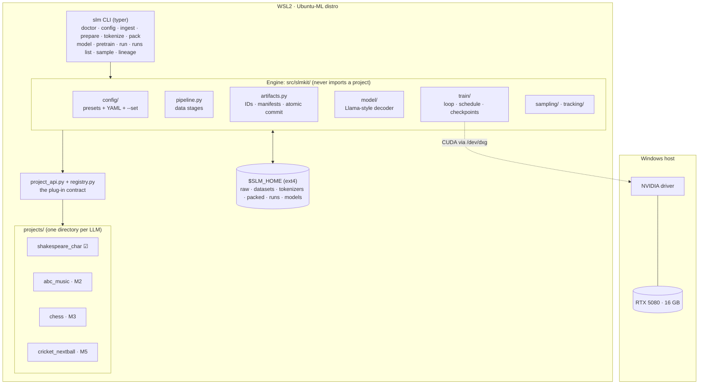
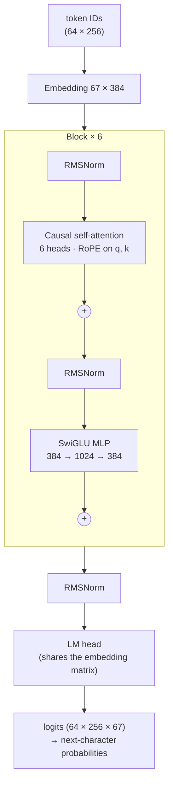
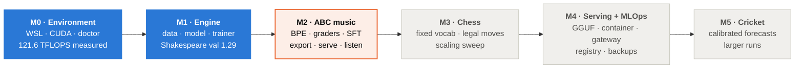
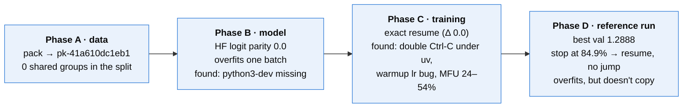

# The model development lifecycle

*How a model goes from raw data to something you can use, and where each step lives in slmkit.
The diagrams are [Mermaid](https://mermaid.js.org/): GitHub renders them directly; in VS Code
install the recommended "Markdown Preview Mermaid Support" extension. Terms:
[`GLOSSARY.md`](GLOSSARY.md).*

*The M1 reference model learning, one frame per evaluation: loss on the left, what it writes
on the right. Details in [`concepts/fitting.md`](concepts/fitting.md).*

---

## 1. Three phases, one loop

Every ML system follows this loop, whatever its size. What changes with scale is how much each box
costs. For slmkit, data preparation takes seconds, training takes GPU-minutes to GPU-hours, and
serving runs on a CPU.

**Infra analogy:** it is a CI/CD pipeline where the build step is training. Artifacts are immutable
and versioned, every build is reproducible from its inputs, and deploying means shipping a versioned
artifact rather than whatever is on disk.

---

## 2. Phase by phase

### Phase 1 · Data preparation

**Goal:** turn raw material into training-ready tokens without leaking evaluation data into training.
This is where most real-world ML failures start, so it gets the most guard rails.

| Step | What happens | slmkit command | Artifact | Why it matters | Status |
|---|---|---|---|---|---|
| Collect | download the source, checksum it | `slm ingest` | `raw/<project>/` | a silently changed upstream file changes every result | ☑ M1 |
| Clean + split | project turns raw files into documents; split by `Doc.group`; augment train only | `slm prepare` | `datasets/…/ds-…` | leakage makes validation lie (CONTRIBUTING.md rule 4) | ☑ M1 |
| Tokenize | fit a vocabulary on the train split | `slm tokenize` | `tokenizers/tk-…` | decides sequence length and embedding size | ☑ char (M1); BPE (M2); fixed (M3) |
| Pack | encode splits to flat `uint16` files | `slm pack` | `packed/pk-…` | fast random access for training | ☑ M1 |

Explainer: [`concepts/tokenization.md`](concepts/tokenization.md). Hands-on: runbook M1 §A.

### Phase 2 · Train and tune

**Goal:** find the model that generalizes best within the compute budget, and prove it.

| Step | What happens | slmkit command | Where results go | Status |
|---|---|---|---|---|
| Pretrain | self-supervised next-token training | `slm pretrain` / `slm run` | `runs/run-…/` (checkpoints, metrics, log) | ☑ M1 |
| Evaluate | validation loss every N steps, samples, best checkpoint | built into the trainer | `metrics.jsonl`, `ckpt/best/` | ☑ M1 |
| Measure | full-split metrics: perplexity, bpc, accuracy | `scripts/val_metrics.py` | printed | ☑ M1 (stop-gap) |
| Grade | project graders on generated outputs, ≥ 3 seeds | `slm eval` | `runs/…/eval/` | M2 |
| Tune | change one thing per experiment YAML, compare | new YAML + `slm runs compare` | one run per config | ☑ by hand (M1 fitting study); `compare` in M2 |
| Fine-tune (SFT) | teach an instruction → answer format, loss on the answer only | `slm sft` | `runs/…` (parent = pretrain run) | ☑ M2 |

**What "tuning" means here.** Hyperparameters are the settings the training doesn't learn by itself:
model size, learning rate, dropout, batch size, how long to train. Each experiment is one YAML file, so
tuning is a set of files that differ in one line each, and every result traces back to its exact config.
M1's fitting study was exactly that: `underfit.yaml`, `nano.yaml` and `ref.yaml` differ only in the model.

Explainers: [`concepts/the-model.md`](concepts/the-model.md),
[`concepts/the-training-loop.md`](concepts/the-training-loop.md),
[`concepts/fitting.md`](concepts/fitting.md), [`concepts/metrics.md`](concepts/metrics.md),
[`concepts/learning-paradigms.md`](concepts/learning-paradigms.md). Hands-on: runbook M1 §B–D.

### Phase 3 · Deploy and manage

**Goal:** make a chosen checkpoint usable outside the training environment, and keep track of it.

| Step | What happens | slmkit command | Status |
|---|---|---|---|
| Inspect | generate text from a checkpoint | `slm sample` | ☑ M1 |
| Export | convert to Hugging Face format (`safetensors` + config + tokenizer + model card); verify logits match | `slm export` | M2 (parity already proven in M1) |
| Serve | small HTTP API, `/generate` | `slm serve` | M2 |
| Package | container image, gateway in front (auth, TLS, rate limits), optional Kubernetes | Dockerfile, Compose | M4 |
| Quantize | GGUF for llama.cpp-style runtimes | documented conversion | M4 |
| Manage | model registry, lineage from model back to raw data, run history, off-box backups | `slm lineage`, `slm runs list`, registry | lineage + runs ☑ M1; registry + backup M4 |
| Monitor | serving latency, error rates, drift in what users ask | — | M4 (light; single-user) |

Specification of every file format involved: [`MODEL.md`](MODEL.md) §6.

---

## 3. The pipeline as built, with M1's real artifacts

Every box is a directory under `$SLM_HOME` with a `manifest.json`. Its ID is a hash of its inputs,
so the same config on any machine produces the same IDs (runbook M1 §A.2), and `slm lineage
pk-41a610dc1eb1` walks this graph backwards. Change `val_fraction` and everything from the dataset
down gets a new ID, while `raw-…` is reused. Nothing is ever overwritten.

---

## 4. System architecture

| Layer | Terraform analogy | Rule that protects it |
|---|---|---|
| Engine (`src/slmkit/`) | provider | never imports a project (a parsing test enforces it) |
| Project (`projects/<name>/`) | root module | a new use case needs no engine change |
| Experiment YAML | tfvars | unknown keys fail loudly |
| `$SLM_HOME` artifacts | state | immutable, content-addressed, never under `/mnt/` |

Platform detail: [`concepts/environment.md`](concepts/environment.md),
[`STACK.md`](STACK.md) (every tool in these boxes).

---

## 5. Inside the model

The residual connections (the two `+` nodes) add each sub-layer's output back into the stream. The
full walk-through with shapes is [`concepts/the-model.md`](concepts/the-model.md); the specification,
presets and file formats are [`MODEL.md`](MODEL.md).

---

## 6. Where slmkit is on the roadmap

Blue: done. Outlined: next. Grey: planned. Each milestone ships code, a concepts page and a runbook,
and ends when its exit criteria are met ([`ROADMAP.md`](ROADMAP.md)).

### Lifecycle coverage by milestone

| Lifecycle step | M0 | M1 | M2 | M3 | M4 | M5 |
|---|---|---|---|---|---|---|
| Environment + tooling | ☑ | | | | | |
| Collect / split / tokenize / pack | | ☑ char | BPE, augmentation | fixed vocab, streaming, exclusions | | ball-event vocab |
| Pretrain + evaluate | | ☑ | sweeps, ≥ 3 seeds | scaling study | | larger runs |
| Graders | | by hand (novelty) | ☑ planned | legal moves, Elo | | calibration |
| Fine-tune (SFT) | | | ☑ | | | |
| Export + serve | | parity proven | ☑ planned | legal-move masking | GGUF, container, gateway | |
| Manage + monitor | | lineage, runs list | model card | | registry, backups | |

---

## 7. What happened in M1, in one picture

Each "found" is a real bug that the checks caught before it reached a result; the story of each is in
the concepts pages and runbooks.
