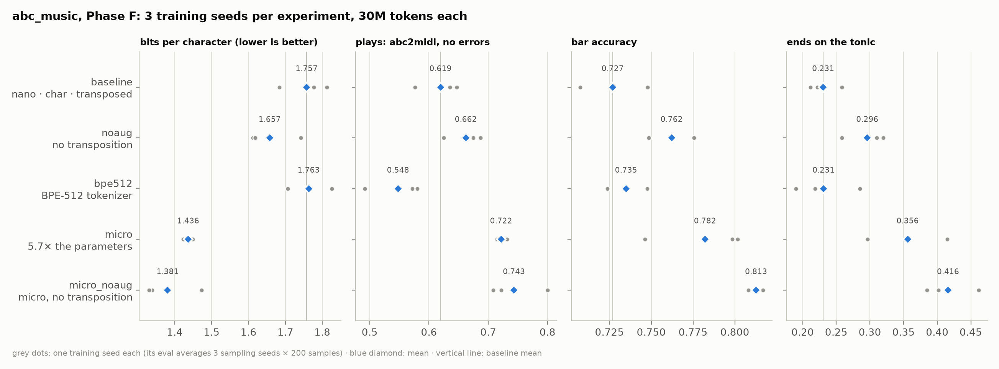

# Running experiments: sweeps, training seeds and equal compute

*Milestone M2, Phase F. Code: [`src/slmkit/eval/summary.py`](../../src/slmkit/eval/summary.py)
(`slm runs summary`), [`projects/abc_music/experiments/`](../../projects/abc_music/experiments/) (one YAML
per experiment), [`projects/abc_music/check_sweep.py`](../../projects/abc_music/check_sweep.py) (the
checks behind §5 and §8). Terms: [`../GLOSSARY.md`](../GLOSSARY.md). Hands-on:
[`../runbooks/m2-abc-music.md`](../runbooks/m2-abc-music.md) §F.*

Phases A–E each ran every experiment once. One run is one draw: retrain with a different seed and
the initial weights and the order the data is read in change, and so does the result. This page is
about asking questions of a model family properly: change one thing, keep the compute equal, repeat
each run with three seeds, and believe only differences bigger than the spread between seeds.

---

## 1. The design

Every experiment is a YAML file that differs from `baseline.yaml` in one place:

| Experiment | Changes | Question |
|---|---|---|
| `baseline` | — (nano, char tokenizer, transposition on) | the reference |
| `micro` | `model.preset: micro` (5.7× the non-embedding parameters) | does size help? |
| `noaug` | `transpose_semitones: []` | does transposition help? |
| `bpe512` | `tokenizer.type: bpe` | char or BPE? |
| `micro_noaug` | both `micro` and `noaug` | added later, §5 |

- **Equal compute.** Every run reads 30M tokens with the same batch, learning rate and schedule. A
  bigger model costs more per token, so `micro` spends more GPU-time, but it gets no more *data*. The
  comparison is "the same reading, a different learner".
- **One factor at a time.** Changing two things at once would make it impossible to say which did
  what. **Rejected:** a full factorial design (all 2 × 2 × 2 combinations), twice the runs for
  interactions this corpus is too small to resolve. §5 shows the cost of that choice: one interaction
  mattered, and a fifth experiment had to be added to test it.
- **Three training seeds** (1337, 1, 2) via `--set run.seed=`. A seed sets the initial weights, the
  dropout masks and the order batches are drawn in. The data split does *not* change (it has its own
  `data.split_seed`), so every run is scored on the same validation tunes.
- **The sweep is a loop over `slm run`**, which trains, fine-tunes where configured, and evaluates.
  Every step resumes or is skipped if done, so a power-off costs at most a checkpoint interval.

**Cost, measured:** all 18 runs (15 pretraining, 3 SFT) used 0.13 GPU-hours. The sweep loop, 10 new
pretraining runs plus 2 SFT runs and their evaluations, took 13 minutes of wall-clock time; the three
`micro_noaug` runs added 6 more. At this scale the time goes to compiling and sampling, not training:
a nano run's 30M tokens take about 25 seconds.

---

## 2. The results

`uv run slm runs summary --project abc_music`, each cell the mean ± standard deviation across three
training seeds. Every run's eval itself averaged 3 sampling seeds × 200 samples.

| | baseline | noaug | bpe512 | micro | micro_noaug |
|---|---|---|---|---|---|
| best val bpc (lower is better) | 1.757 ± 0.067 | 1.657 ± 0.074 | 1.763 ± 0.060 | 1.436 ± 0.013 | **1.381** ± 0.080 |
| plays | 0.619 ± 0.038 | 0.662 ± 0.033 | 0.548 ± 0.049 | 0.722 ± 0.009 | **0.743** ± 0.050 |
| bar_accuracy | 0.727 ± 0.020 | 0.762 ± 0.013 | 0.735 ± 0.012 | 0.782 ± 0.031 | **0.813** ± 0.004 |
| ends_on_tonic | 0.231 ± 0.025 | 0.296 ± 0.033 | 0.231 ± 0.049 | 0.356 ± 0.059 | **0.416** ± 0.040 |
| novelty | 0.998 | 0.998 | 0.993 | 0.997 | 0.998 |
| GPU-hours (3 runs) | 0.02 | 0.02 | 0.01 | 0.03 | 0.03 |

*Generated by `make figures` from `slm runs summary`'s own code.*

How to read a difference: compare it with the spreads on both sides. Below about twice the spread,
three seeds can't tell the two apart.

---

## 3. Two kinds of noise, and what the second one undid

Phase C's single-seed comparison said char and BPE differ on two graders. The gaps were measured
against the **sampling** spread: how much one model's score moves between batches of 200 samples.
That spread is small (±0.01–0.03), because it only re-rolls the samples. The **training** spread,
from retraining, is bigger, because it re-rolls the model:

| char vs BPE-512 | Phase C, seed 1337 only | Phase F, 3 training seeds | verdict |
|---|---|---|---|
| bits per character | 1.813 vs 1.826 | 1.757 ± 0.067 vs 1.763 ± 0.060 | a tie, confirmed |
| plays | 0.647 vs 0.492 | 0.619 ± 0.038 vs 0.548 ± 0.049 | char ahead, smaller than it looked |
| bar_accuracy | 0.708 vs 0.733 | 0.727 ± 0.020 vs 0.735 ± 0.012 | **no difference**; the Phase C gap was one draw |

The baseline itself shows the effect: seed 1337 scored 1.813 bpc, the three-seed mean is 1.757, a
whole spread away. **A single run can be off by its own spread**, which is why DESIGN §7 asks for ≥ 3
seeds, and why `slm eval`'s ± (sampling noise) can't stand in for `slm runs summary`'s ± (training
noise).

---

## 4. Model size: bigger wins, and starts to memorize

`micro` beats `nano` on everything, and by more than the spread: 1.436 vs 1.757 bits per character,
plays 0.722 vs 0.619, ending on the tonic 0.356 vs 0.231. Recall evaluation.md §5: ending on the tonic
needs the model to connect the last note to a key stated hundreds of characters earlier. That
long-range pattern is exactly what extra layers and width buy.

The training curves show a second difference, which turns out to matter for §5:

| | best step (of 916) | gap at the end (val − train loss) |
|---|---|---|
| nano (`baseline`, all 3 seeds) | 916, the last | +0.06 |
| micro (3 seeds) | 500–916, flat from ~750 | +0.31 to +0.36 |

`nano` is still improving when the budget runs out: it is **capacity-limited**, and more reading
would help it more than more variety would. `micro` learns the training tunes faster than it learns
to generalize and starts to memorize from about half-way: it is **data-limited**. The best-checkpoint
rule keeps the good version, so memorization doesn't reach the scores; novelty stays at 0.997.

Cost: `micro` took 1.5× the GPU-time of `nano` for the same 30M tokens (0.03 vs 0.02 GPU-hours for
three runs). At this scale, the size is worth it.

---

## 5. Augmentation: the result nobody predicted

Transposition was the headline of Phase A: every training tune also appears transposed by up to two
semitones, tripling the data, verified note for note. At equal compute, **turning it off made the
nano model better**: 1.657 vs 1.757 bits per character, and higher on every grader.

When a result looks too good, suspect leakage first. It isn't leakage:

- `noaug` validates on exactly the same 419 tunes (same 107,031 tokens, same 87-character vocabulary,
  no unknown characters). Augmentation happens after the split, on train only.
- At most 0.3% of 32-character windows in either validation set appear verbatim in either training
  set, and no tune is even half-seen (`check_sweep.py overlap`).

**The first explanation, and its test.** §4 suggested one: nano is capacity-limited, and a model that
can't yet fit the data gets nothing from more of it. `micro` is data-limited, so augmentation should
help *there*. The one-factor design can't test that, because it never changes size and augmentation
together. So `micro_noaug.yaml` was added: one more YAML, three more seeds, five minutes. The
prediction failed: `micro_noaug` is as good as `micro` or better (1.381 ± 0.080 vs 1.436 ± 0.013
bpc, and higher on every grader).

**The explanation that holds: it depends on what you test.** The validation tunes, and the eval
prompts (reel in D, jig in G, hornpipe in A, air in E minor), are in the keys the tune books use.
Transposition teaches keys the evaluation never asks about. So score the same validation tunes both
ways, in their original keys and transposed the way training data is (`check_sweep.py keys`):

| bits per character | original keys | transposed copies | difference |
|---|---|---|---|
| baseline (nano, transposed) | 1.744 ± 0.068 | 1.756 ± 0.072 | +0.012 |
| noaug (nano) | 1.644 ± 0.076 | 1.830 ± 0.086 | **+0.185** |
| micro (transposed) | 1.419 ± 0.016 | 1.247 ± 0.131 | −0.172 |
| micro_noaug | 1.361 ± 0.079 | 1.569 ± 0.101 | **+0.208** |

(Only the 412 validation tunes that have transposed copies; the other seven don't transpose cleanly.)

Models trained without transposition are about 0.19 bits per character worse on a tune moved two
semitones: they learned "these keys", not "tunes". Models trained with it pay no penalty. Augmentation
bought **robustness to key**, and the evaluation never asked for it. At equal compute, the reading it
spends on other keys is reading the no-augmentation model spends on the keys that are tested.

**What remains unexplained:** `micro` with transposition scores *better* on transposed copies than on
the originals (−0.172), in two of three seeds (1.225 and 1.129 against ~1.42). Nano shows nothing
similar, so the transposed text isn't simply easier. One visible difference: transposing up pushes
more notes into the high octave, written with a trailing `'` (3.9 per 1,000 characters against 1.1),
and that character is very predictable. That is a hypothesis, not a demonstrated cause, and it's
recorded here as open.

**The lesson:** an augmentation is a claim about the data you'll be tested on. "More data" helps only
if it is more of what the test asks for; otherwise it spends capacity and compute elsewhere. For this
project: if requests will always be in common keys, train without transposition; if a user may ask
for a reel in E♭, keep it, and add transposed prompts to the evaluation so the benefit shows.

---

## 6. SFT, across three seeds

Each baseline seed was fine-tuned and evaluated with plain-language requests (the `sft` column of
`slm runs summary`), against the same base models given header prompts:

| | base model, header prompts | SFT model, asked in words |
|---|---|---|
| plays | 0.619 ± 0.038 | **0.677** ± 0.049 |
| bar_accuracy | 0.727 ± 0.020 | **0.800** ± 0.050 |
| ends_on_tonic | 0.231 ± 0.025 | **0.328** ± 0.015 |
| ended | 0.922 ± 0.014 | **0.981** ± 0.001 |

The parity result holds across seeds (the M2 exit criterion), and SFT is ahead on every grader. The
single-seed numbers in sft.md §4 (bars 0.851) were the high end of the range.

---

## 7. What this sweep can't tell you

- **Anything bigger.** Two sizes aren't a scaling law. M3's scaling sweep uses at least three sizes,
  with the learning rate re-tuned per size (DESIGN §4: it doesn't transfer across sizes).
- **Anything at another budget.** Every conclusion is "at 30M tokens". A capacity-limited nano might
  catch up with more reading; a data-limited micro won't.
- **Small effects.** With three seeds, differences under about twice the spread stay unresolved.
  More seeds cost linearly and shrink the spread of a mean only as √n.

---

## 8. The parse-rate criterion, and what "parses" should mean

The M2 exit criteria ask for a parse rate of at least 95%. Three definitions give very different
answers on the same samples (`check_sweep.py parse`, 200 samples per model):

| | parses (headers + notes) | abc2midi makes a MIDI file | plays with no errors |
|---|---|---|---|
| best models (micro_noaug, 3 seeds) | 1.000 | 1.000 | 0.665 – 0.785 |
| random characters (the no-model baseline) | 0.915 | 0.915 | 0.045 |

`abc2midi` recovers from almost anything, so random characters "parse" 91.5% of the time. A metric
that noise nearly passes measures nothing: the same lesson as `ends_in_key` in evaluation.md §5. The
strict one, `plays`, is the only meaningful parse rate here, and the best model reaches 0.74.

Sampling can buy some of the gap, but not for free (`check_sweep.py temperature`, one micro_noaug
run):

| temperature | plays | bar_accuracy | finishes by itself | novelty |
|---|---|---|---|---|
| 1.0 | 0.620 | 0.767 | 0.995 | 1.000 |
| **0.8** (the eval setting) | **0.785** | **0.815** | **0.995** | **1.000** |
| 0.6 | 0.850 | 0.801 | 0.920 | 0.974 |
| 0.4 | 0.890 | 0.825 | 0.840 | 0.915 |
| 0.2 | 0.945 | 0.846 | 0.860 | 0.957 |

Lower temperature means safer, more common tokens: fewer grammar slips, but tunes that loop instead of
finishing and copy more from training (novelty 0.915 at 0.4). Near-greedy decoding approaches 95%
by trading one failure for another. The principled fixes are a larger or longer-trained model, or
constrained decoding that makes an invalid token impossible to sample, which is the
`logits_processor` M3 builds for chess.
