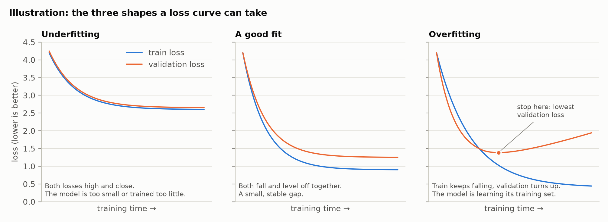
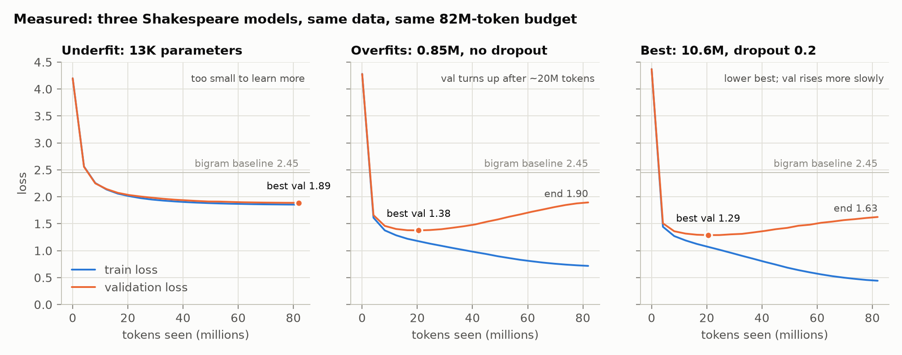

# Underfitting, overfitting, and reading a loss curve

*Terms: [`../GLOSSARY.md`](../GLOSSARY.md). Figures are generated from real runs by
[`scripts/make_figures.py`](../../scripts/make_figures.py); nothing on this page is drawn by hand
except the one labelled "Illustration".*

A model is trained on one set of data and judged on another it has never seen. How the two losses
move against each other tells you which of three situations you are in, and what to do about it.

---

## 1. What to expect

| Shape | Train loss | Validation loss | Gap | Diagnosis | What to do |
|---|---|---|---|---|---|
| **Underfitting** | high, flattens early | high, close to train | tiny | The model can't represent the pattern: too small, trained too little, or lr too low | bigger model, more training, check the lr |
| **Good fit** | falls, levels off | falls, levels off just above train | small, stable | Learning what generalizes | stop when validation stops improving |
| **Overfitting** | keeps falling | falls, bottoms out, then **rises** | widens | Fitting quirks of the training set that don't carry over | keep the best checkpoint, more data, more dropout, smaller model, or train less |

**Why validation is the judge.** Training loss can always be driven down by fitting the training set
more tightly. Validation loss comes from text the model has never trained on, so it only improves
when the model has learned something true in general. That is also why the split must be leak-free
(`Doc.group`, CONTRIBUTING.md rule 4): if validation text leaks into training, the right-hand column stops
meaning anything.

**The gap is the early warning.** An overfitting run's validation loss usually drifts for a while
before it clearly turns up, but the gap between train and validation grows steadily from the start.

---

## 2. What slmkit actually produced

Three models on the **same data** (Shakespeare, 1.1M characters) with the **same budget** (82M
tokens, ~80 passes over the training text) and the same settings. Only the model changes:

| Run | Model | Best val loss (where) | Final train / val | Final gap | Shape |
|---|---|---|---|---|---|
| `shakespeare_char/underfit` | 13K parameters, 1 layer | **1.888** (the end) | 1.855 / 1.888 | +0.03 | **Underfitting.** Still creeping down at the end, train and validation almost equal. It has learned all it has room for |
| `shakespeare_char/nano` | 0.85M, no dropout | **1.377** (20.5M tokens) | 0.718 / 1.895 | +1.18 | **Overfitting**, strongly. The final model is worse on unseen text than the tiny one |
| `shakespeare_char/ref` | 10.6M, dropout 0.2 | **1.289** (20.5M tokens) | 0.442 / 1.625 | +1.18 | **Overfitting**, but a lower best and a slower rise |

Reproduce with `uv run slm pretrain shakespeare_char/<run>` (each under a minute of GPU), then
`uv run python scripts/make_figures.py`.

### What to read off it

- **Size helps, up to a point.** 13K → 0.85M parameters takes the best validation loss from 1.89 to
  1.38. 0.85M → 10.6M only takes it to 1.29. The corpus is small, so the benefit of size runs out
  quickly.
- **Both bigger models reach their best at the same point**, 20.5M tokens (~20 passes over the text),
  and both overfit after it. What differs is how far down they get first and how fast validation
  loss climbs afterwards: `nano` rises 0.52 from its best, `ref` 0.34. Dropout 0.2 slows the rise;
  it doesn't prevent it.
- **The final checkpoint is the wrong one to keep.** For `nano`, the final model (1.90) is *worse* on
  unseen text than the 13K-parameter underfit model (1.89). That is why the trainer saves
  `ckpt/best/` separately, at the lowest validation loss, and why `slm sample` uses it by default.
  Stopping at the best point is called **early stopping**.
- **The underfit model is not broken.** It beats the letter-pair baseline (2.45) easily. It has simply
  learned everything 13K numbers can hold, which is why its train and validation losses are nearly
  equal.

### "Overfitting" did not mean "copying" here

The usual explanation of overfitting is memorization, so it was measured rather than assumed. Samples
from `ref`'s final checkpoint were checked against the training text: **no 40-character passage
appears verbatim**, no more than from the best checkpoint (runbook M1 D.3). The rising validation loss
comes from **over-confidence**: the late model assigns very high probability to patterns specific to
its training text, and cross-entropy punishes a confident wrong guess much more than a hesitant one
(−ln 0.01 = 4.6, against −ln 0.3 = 1.2). Its generated text still reads as plausible verse.

---

## 3. The same story, animated

The `ref` run, one frame per evaluation: the loss curves so far, and what the model writes after
`ROMEO:` at that moment.

Step 0 is random characters. By step 250 it has speaker names and line breaks. By 1,000 it spells
most words. After ~1,250 the validation curve starts to turn up while the text keeps looking fluent.

---

## 4. Other curves worth recognizing

These did not happen here, but you will meet them:

| What you see | Likely cause | First thing to try (CONTRIBUTING.md debugging order) |
|---|---|---|
| Loss flat from step 0 | lr far too low, or a wiring bug | overfit one batch (Phase B, B.5) |
| Loss spikes, then recovers | lr too high, or a bad batch | lower lr, longer warmup; check `gnorm` |
| Loss becomes `nan` | numerics, or lr much too high | the guard skips such steps and aborts after 20; lower the lr |
| Validation *below* train in the eval lines | validation text happens to be easier than training text | usually harmless; if large, check the split. (The per-step `loss` in the log runs higher than the eval's train loss for a different reason: dropout is on during training steps and off during evals) |
| Validation suspiciously good early | **leakage**, or a mask that lets the model see the answer | check the split and causality first (the-training-loop.md §2) |
| Train falls, validation never moves | data or target mismatch (off-by-one) | the one-token shift test (runbook A.8) |

---

## 5. How slmkit handles this for you

| Mechanism | Where |
|---|---|
| Group split, so validation is truly unseen | `data/split.py`, runbook A.6 |
| Evaluation every `eval_every_steps`, train *and* validation, same fixed batches each time | `train/trainer.py`, the-training-loop.md §5 |
| The gap printed on every eval line (`gap +0.0644`) | trainer log |
| `ckpt/best/` kept at the lowest validation loss | early stopping without stopping the run |
| Samples printed at every eval | catches a good number with bad text, or the reverse |
| Dropout in presets that train on small data (`ref` 0.2) | `presets/model/` |
