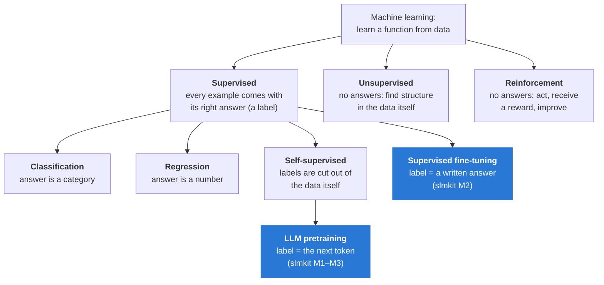

# What kind of learning is this?

*A map of machine learning, and where slmkit sits on it. Terms: [`../GLOSSARY.md`](../GLOSSARY.md).
Related: [`metrics.md`](metrics.md) (how each kind is measured), [`fitting.md`](fitting.md).*

"Machine learning" covers several different set-ups that differ in one thing: **where the
right answers come from.** That one question decides what data you need, what the model
outputs, and how you measure it.

---

## 1. The three families



Blue boxes are what slmkit does.

### Supervised learning: examples with answers

Each training example is an **input** paired with the **right output** (a *label*). The model
learns to map one to the other, and is graded by comparing its output with the label.

| | **Classification**: the answer is one of a fixed set of categories | **Regression**: the answer is a number on a continuous scale |
|---|---|---|
| Everyday examples | Is this email spam or not? Which of 10 digits is in this image? Is this log line an error, a warning or info? | What will this house sell for? How many minutes until this build finishes? Tomorrow's peak CPU load? |
| Model outputs | a probability for each category (spam 0.93, not spam 0.07) | one number (US$412,000) |
| Typical loss | cross-entropy (−ln of the probability given to the right class) | mean squared error ((prediction − truth)²) |
| Typical metrics | accuracy, precision, recall, F1 | MAE, RMSE (see [`metrics.md`](metrics.md)) |
| Infra analogy | an alert classifier routing pages to the right team | capacity planning: forecasting disk usage next month |

### Unsupervised learning: no answers, find structure

The data has no labels. The model finds patterns on its own: groups of similar items
(**clustering**), a compact summary (**dimensionality reduction**), or what is unusual (**anomaly
detection**).

Examples: grouping customers by purchase behaviour without predefined segments; flagging a login
pattern unlike any seen before; compressing thousands of server metrics into the few directions
that explain most of the variation. The catch is that there is no single "right answer" to
measure against, so evaluation is harder and often subjective.

### Reinforcement learning: act, get a reward, improve

The model (an *agent*) takes actions in an environment and receives a reward signal, often
delayed. Nobody says what the right action was, only how well things went. Examples: game-playing
programs, robot control, and the RLHF stage used on chat assistants (a model is rewarded for
answers people prefer). **slmkit does not do reinforcement learning.** Its chess model is trained
only to predict moves from recorded games, not by playing and being rewarded.

---

## 2. Where LLM training fits: supervised, with free labels

Next-token prediction is **classification**. At every position the model outputs a probability for
each of the 67 characters in the vocabulary, and is graded by cross-entropy against the one that
actually came next. Shakespeare-ref is a **67-way classifier**, run 256 times per sequence.

What makes it special is where the labels come from:

```
text:     R  O  M  E  O  :
inputs:   R  O  M  E  O          ← the model sees these
labels:      O  M  E  O  :       ← the "right answers" are the same text, shifted by one
```

Nobody wrote those labels. They are cut out of the text itself. This is called **self-supervised
learning**: supervised in its mechanics (every prediction has a correct answer and a loss), but
needing only raw text rather than human annotation. That is why language models can train on
millions of documents: the internet does not come labelled, but every sentence is its own answer
key.

People sometimes call LLM pretraining "unsupervised" because no human labels are involved.
"Self-supervised" is the more precise term, and it matters: the model is always being graded
against a right answer, which is exactly why a loss curve exists at all.

---

## 3. slmkit's projects, classified

| Stage / project | Family | Output per step | Label comes from | Status |
|---|---|---|---|---|
| **Pretraining**, any project | self-supervised classification | a probability for each token in the vocabulary | the next token in the data | M1 ☑ |
| `shakespeare_char` | self-supervised, 67-way classification | the next character | the text | M1 ☑ |
| `abc_music` pretraining | self-supervised, ~70–1,000-way classification (char or BPE) | the next symbol of a tune | the tunes | M2 |
| `abc_music` **SFT** | supervised fine-tuning (**sequence generation**) | a whole tune, token by token | a prompt/answer pair built from each tune's `R:`/`M:`/`K:` headers | M2 |
| `chess` | self-supervised, 1,968-way classification | the next move | recorded games | M3 |
| `cricket_nextball` | self-supervised classification over ball outcomes, graded as a **probability forecast** | the next ball's outcome (dot, 1, 4, wicket…) | recorded matches | M5 |
| (none) | regression | — | — | not used: every slmkit target is a token |

**Why no regression?** Every slmkit model outputs tokens. Even a number, such as runs off a ball, is
treated as one of a handful of categories (0, 1, 2, 3, 4, 6, wicket). Predicting a probability for each
is more informative than predicting one number: "40% dot ball, 5% wicket" says far more than
"expected 1.1 runs". It also keeps one model family for everything (CONTRIBUTING.md rule 5).

**SFT is supervised in the classic sense.** In M2 each training example is an instruction such as
"a slip jig in E minor" plus a tune that satisfies it, and the loss is computed only on the tune (the
answer), not on the instruction. It is still next-token classification underneath; what changes is
that the labels now come from a constructed prompt → answer pairing rather than raw text order.

---

## 4. Why it matters in practice

| If the task is… | You need | You measure with |
|---|---|---|
| Classification | labelled examples, ideally balanced across classes | accuracy, precision/recall/F1, cross-entropy |
| Regression | examples with numeric targets | MAE, RMSE |
| Self-supervised pretraining | lots of raw, clean, de-duplicated text | validation loss, perplexity, bits per character, **plus samples** |
| Generation (SFT) | prompt/answer pairs | task graders on generated outputs (does the tune parse? is it in the right key?) |
| Unsupervised | raw data | mostly indirect: does the structure found help a downstream task? |

The last column is the subject of [`metrics.md`](metrics.md).
