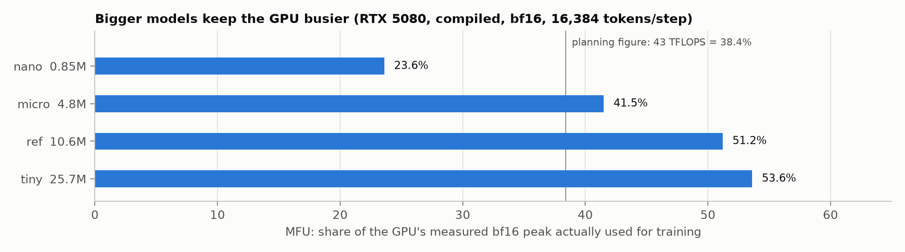

# Performance metrics: which number, when

*Terms: [`../GLOSSARY.md`](../GLOSSARY.md). Related: [`learning-paradigms.md`](learning-paradigms.md)
(the kind of task decides the metric), [`fitting.md`](fitting.md) (reading metrics over time).*

A metric is only meaningful for the kind of task it was designed for, and only next to a
**baseline**: the score of something trivially simple. "60% accuracy" is excellent if guessing
gets 15%, and useless if guessing gets 90%.

Three groups matter to slmkit: **model quality** (how good are the predictions?), **task quality**
(is the output actually right for its purpose?), and **system performance** (how fast and costly
is it?).

---

## 1. Model quality for a language model, measured

These come straight from the loss, so they apply to every slmkit model. Real numbers: each run's
best checkpoint scored on the **entire** Shakespeare validation split, 111,360 characters, every one
scored once.

```bash
uv run python scripts/val_metrics.py run-f6d4 run-d020 run-a1d5
```

| Model | Loss (nats/char) | Perplexity | Bits per char | Top-1 accuracy | Top-5 accuracy |
|---|---|---|---|---|---|
| baseline: letter frequencies, no model | 3.326 | 27.8 | 4.80 | 15.2% | 40.3% |
| `underfit` (13K params) | 1.889 | 6.61 | 2.73 | 43.7% | 78.4% |
| `nano` (0.85M) | 1.376 | 3.96 | 1.99 | 58.3% | 86.2% |
| **`ref` (10.6M)** | **1.289** | **3.63** | **1.86** | **60.7%** | **87.7%** |

What each column means, using `ref`:

| Metric | Definition | Reading it for `ref` | Better is |
|---|---|---|---|
| **Loss** (cross-entropy) | average −ln(probability given to the character that actually came next) | the true next character got probability e^−1.289 ≈ 0.28 on (geometric) average | lower |
| **Perplexity** | e^loss | as uncertain as choosing uniformly among **3.6** characters (instead of 67) | lower; 1 is perfect |
| **Bits per character** (bpc) | loss ÷ ln 2 | 1.86 bits to encode each character; a plain ASCII file spends 8 | lower |
| **Top-1 accuracy** | how often the single most likely prediction is exactly right | the exact next character, **61%** of the time | higher |
| **Top-5 accuracy** | how often the right answer is among the 5 most likely | right character in its top 5, 88% of the time | higher |

Notes:

- **Loss is the one to trust**; the others are translations of it into more readable units. It uses
  the full probability the model gave the right answer, where accuracy only asks whether that answer
  came first.
- **Perplexity and bpc depend on the tokenizer.** A BPE model's tokens are ~3–4 characters each, so
  its per-token perplexity is far higher even when it is the better model. Compare across tokenizers
  in **bits per character**, never in per-token loss. This matters in M2, which compares char vs BPE
  on ABC music.
- **Accuracy understates a language model.** After `ROMEO:\n` many next characters are reasonable. A
  model that spreads probability sensibly across them scores a good loss but a mediocre top-1. That is
  why top-5 is 88% while top-1 is 61%.
- The trainer's eval line reports the same loss on randomly sampled windows (1.2888); this full pass
  gives 1.2894. The difference is sampling noise, and it confirms the quick estimate is sound.

---

## 2. Classic metrics, for when the task is classification or regression

Not every metric fits every task. These are the standard ones, where slmkit uses them, and a worked
example each.

### Classification: accuracy, precision, recall, F1

Take a spam filter tested on 1,000 emails, 100 of which are really spam. It flags 90 emails; 80 of
those are really spam.

| | really spam | really not spam |
|---|---|---|
| **flagged as spam** | 80 (true positive) | 10 (false positive) |
| **not flagged** | 20 (false negative) | 890 (true negative) |

| Metric | Formula | Here | Answers |
|---|---|---|---|
| **Accuracy** | correct ÷ all | (80 + 890) ÷ 1000 = **97%** | how often is it right? Misleading when classes are unbalanced: flagging *nothing* scores 90% |
| **Precision** | TP ÷ (TP + FP) | 80 ÷ 90 = **89%** | when it says "spam", how often is it right? (cost of false alarms) |
| **Recall** | TP ÷ (TP + FN) | 80 ÷ 100 = **80%** | of the real spam, how much did it catch? (cost of misses) |
| **F1** | 2 · P · R ÷ (P + R) | **84%** | one number balancing the two |

Infra analogy: an alerting rule. Precision is "what fraction of pages were real incidents"; recall is
"what fraction of real incidents paged someone". Tuning a threshold trades one for the other.

**In slmkit:** next-token prediction is 67-way classification, but with so many classes and such
natural ambiguity, top-k accuracy and loss are more useful than precision/recall. Precision and recall
become relevant for **graders that make a yes/no call**, e.g. M2's "does this tune end on the tonic"
checked against hand-labelled good and bad fixtures.

### Regression: MAE, RMSE

A disk-usage forecast predicts 50, 60 and 80 GB; the real values are 52, 55 and 90.

| Metric | Formula | Here | Note |
|---|---|---|---|
| **MAE** (mean absolute error) | average of \|prediction − truth\| | (2 + 5 + 10) ÷ 3 = **5.7 GB** | "typically off by this much", in the target's own units |
| **RMSE** (root mean squared error) | √(average of (prediction − truth)²) | √((4 + 25 + 100) ÷ 3) = **6.6 GB** | punishes large misses more; always ≥ MAE |

**In slmkit:** not used. Every target is a token (see [`learning-paradigms.md`](learning-paradigms.md) §3).

### Probability forecasts: calibration, log-loss, Brier score

When the output is a probability ("30% chance of a boundary off this ball"), the question is not only
"was the top guess right" but "were the probabilities honest". A model is **calibrated** if, of all the
times it said 30%, the event happened about 30% of the time. **Log-loss** is the same cross-entropy as
above; the **Brier score** is the mean squared error of the probabilities.

**In slmkit:** the main metric for `cricket_nextball` (M5), compared against a baseline that always
predicts historical frequencies.

---

## 3. Task quality: graders

Low loss says the model predicts text well. It does not say a generated tune is *valid music* or a
chess move is *legal*. For that, every slmkit project defines **graders**: pure functions scoring each
generated output against a rule a program can check (CONTRIBUTING.md: projects are only chosen if such a
grader exists).

| Project | Graders (planned) | Baseline to beat |
|---|---|---|
| `shakespeare_char` | none: loss plus samples | letter frequencies (above) |
| `abc_music` (M2) | parse rate; bar durations match the meter (`M:`); ends on the key's tonic (`K:`); prompt adherence after SFT; **n-gram novelty** (not copying training tunes) | random / unigram tunes; the base model given a header prefix |
| `chess` (M3) | legal-move rate; puzzle accuracy; Elo against Stockfish at fixed strength | random legal moves |
| `cricket_nextball` (M5) | log-loss, calibration, Brier score | historical outcome frequencies |

The n-gram novelty grader was already run by hand in M1 (runbook D.3): 0% of 40-character windows in
`ref`'s samples appear in its training text.

**Run ≥ 3 seeds before believing a difference** (DESIGN §6.7). At this scale, two runs differing only
in random seed can differ by more than the change you are testing.

---

## 4. System performance

These say nothing about quality, but they decide what is affordable on one GPU.

| Metric | Meaning | Measured (`ref`, M1) | Where |
|---|---|---|---|
| **Tokens/s** | training throughput | ~810,000–830,000 | trainer log at step 50 |
| **TFLOPS achieved** | tokens/s × FLOPs per token | 57–59 | same |
| **MFU** | achieved ÷ measured peak | 51–53% | same; per preset below |
| **GPU-hours** | the budget unit (never wall-clock dates) | 0.05 for the whole run | `slm runs list` |
| **Peak memory** | largest GPU allocation | 1.58 GiB of 16 | trainer log |
| **Checkpoint size** | bytes on disk per checkpoint | 122 MB | `du -sh ckpt/*` |
| **Latency / tokens-per-second at inference** | serving speed | *M2/M4, with `slm serve`* | — |



| Preset | Parameters | Tokens/s | MFU |
|---|---|---|---|
| nano | 0.85M | 3,915,615 | 23.6% |
| micro | 4.8M | 1,378,216 | 41.5% |
| ref | 10.6M | 808,923 | 51.2% |
| tiny | 25.7M | 360,021 | 53.6% |

---

## 5. Which metric, when: summary

| Question | Metric | Applies to |
|---|---|---|
| Is the model learning at all? | training loss vs ln(vocab) | every run, from step 0 |
| Is it generalizing? | validation loss and the train/val gap | every run, every eval |
| How good is it, in plain terms? | perplexity, bits per char, top-k accuracy | language models |
| Is the output fit for purpose? | project graders | M2 onwards |
| Is it copying its training data? | n-gram novelty | generative models (M2 grader) |
| Is a difference real? | the same metric over ≥ 3 seeds | any comparison |
| Can we afford it? | tokens/s, MFU, GPU-hours, memory | every run |
| Classification with yes/no decisions | precision, recall, F1 | grader validation, alerting-style tasks |
| Numeric prediction | MAE, RMSE | not used in slmkit |
| Probability forecasts | log-loss, calibration, Brier | cricket (M5) |
