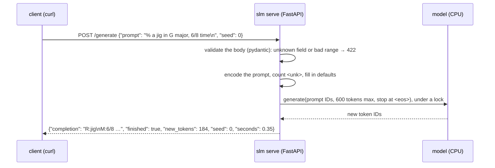
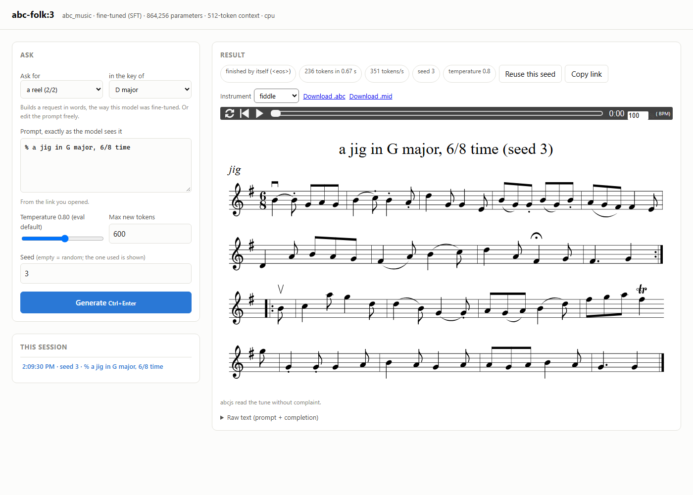

# Export and serving: from checkpoint to something you can use

*Milestone M2, Phase E. Code: [`src/slmkit/export/`](../../src/slmkit/export/) (export, model card,
Windows copy), [`src/slmkit/serve/app.py`](../../src/slmkit/serve/app.py) (the HTTP API). Decision:
[ADR 0007](../decisions/0007-model-export-and-render-hook.md). File formats:
[`../MODEL.md`](../MODEL.md) §6. Terms: [`../GLOSSARY.md`](../GLOSSARY.md). Hands-on:
[`../runbooks/m2-abc-music.md`](../runbooks/m2-abc-music.md) §E.*

Training leaves behind **checkpoints**: files written by the trainer, for the trainer, so that it can
resume. They are the wrong thing to hand anyone else. Deploying a model takes two steps:

- **Export**: write the chosen checkpoint in a standard, self-describing format, with the tokenizer,
  the default settings and a model card. The infrastructure analogy is building a container image
  and tagging it: an immutable, versioned thing that runs without the build environment.
- **Serve**: a process that loads the export and answers requests over HTTP, the equivalent of
  running that image.

---

## 1. Checkpoint versus export

| | Resume checkpoint | Export |
|---|---|---|
| Written by | the trainer, every 20 minutes | `slm export`, once per version |
| For | the trainer, to resume exactly | people, `slm serve`, Hugging Face tools |
| Contains | weights, optimizer moments, RNG and sampler state | weights, config, tokenizer, defaults, card |
| Format | `torch.save` (pickle) | safetensors + JSON |
| Size (the `abc_music` nano model) | 10 MB | 3.4 MB |
| Identity | run ID + step, changes while training | `abc-folk:1`, never changes |

The checkpoint is three times larger because AdamW keeps two running averages per parameter
(the-training-loop.md §4). They matter for continuing training and are useless for generating.

---

## 2. What an export contains

```
$SLM_HOME/models/abc-folk/1/
├── config.json               the architecture, under Hugging Face's names
├── generation_config.json    default sampling settings
├── model.safetensors         864,256 parameters, fp32, 38 tensors
├── tokenizer.json            the tokenizer, Hugging Face format
├── tokenizer_config.json     which tokens are <unk> and <eos>
├── MODEL_CARD.md             how to prompt it, how it was trained and scored, its limits
└── manifest.json             lineage and the parity results
```

**`config.json` is slmkit's `ModelArgs` renamed.** slmkit's parameter names already match Hugging
Face's `LlamaForCausalLM` (MODEL.md §6), so export changes file format, not numbers:

```
d_model 128      → hidden_size 128           n_heads 4     → num_attention_heads 4
n_layers 4       → num_hidden_layers 4       ffn_hidden 384 → intermediate_size 384
block_size 512   → max_position_embeddings 512
```

**The output head is stored once.** With tied embeddings, the output layer *is* the embedding matrix
(the-model.md §2). safetensors can't express "these two names are one tensor", so `lm_head.weight` is
left out and `tie_word_embeddings: true` tells the loader to re-tie it. That's why the file holds 38
tensors, not 39.

**Default sampling settings travel with the model.** `generation_config.json` holds the settings the
evaluation used: temperature 0.8, no top-k, no top-p, at most 600 new tokens. Scores on the model card
were measured with these, so a user who keeps them gets the quality the card promises. One trap
avoided here: Hugging Face's own default is `top_k = 50`, not "off", so the file says `top_k: 0`
explicitly. For an 87-token vocabulary, top-50 would silently cut the tail the evaluation sampled from.

---

## 3. The tokenizer has to travel too

A model predicts token IDs. Without the exact tokenizer it was trained with, the IDs mean nothing: ID
52 is `d` for this model and something else entirely for another.

slmkit's character tokenizer is its own ten lines of code, which nothing outside slmkit can read. The
export writes it as a Hugging Face **WordLevel** tokenizer whose "words" are single characters, split
one character at a time. The IDs are identical:

```
"% a jig"   slmkit:  [7, 4, 58, 4, 67, 66, 64]
            HF:      [7, 4, 58, 4, 67, 66, 64]
```

**The frozen vocabulary is visible to users.** Characters the model never saw become `<unk>`. The
server counts them in every response. Asked "Write a jig?", it reports `unknown_prompt_tokens: 2`
(the `W` and the `?`, sft.md §1). Asked "a jig in G major", it reports 0.

---

## 4. Proving the export is right

An export that loads without errors can still be wrong: a transposed matrix, a different RoPE
convention or a mismatched tokenizer all load fine and produce subtly worse text. So every export is
checked **before it is published**, over the example prompt plus a 64-token greedy continuation:

1. **slmkit reads the exported files back.** The logits must be *identical* to the checkpoint's. This
   catches anything lost in the file format.
2. **Hugging Face `transformers` reads them** through `AutoModelForCausalLM` and `AutoTokenizer`, as
   any user would. The token IDs must match and the logits must agree within 1e-4.

The export is built in a `.tmp` directory and renamed into place only if both pass, like every other
artifact (DESIGN §6.2). Measured on the three `abc_music` exports:

```
slmkit round trip: max |Δlogit| = 0.0e+00 over 84 tokens
transformers 5.17.0: max |Δlogit| = 0.0e+00, tokenizer IDs match: True
```

**Is exactly 0.0 suspicious?** Not here: both sides run the same PyTorch CPU kernels on the same fp32
numbers in the same order, so they produce the same bits. On a GPU, or with a different PyTorch
version, the order of additions can change and the difference becomes ~1e-6; the 1e-4 tolerance
allows for that. That the comparison *can* fail is proven separately: M1's
`test_the_comparison_is_sensitive` changes the RoPE base and watches the logits move by more than 1e-3.

---

## 5. Versions, not overwrites

A model is addressed as **`name:version`**, like a container image tag, and a version never changes.
Exporting the same checkpoint again does nothing; exporting a different one under the same version is
refused with a hint to use the next number. A client that tested against `abc-folk:1` gets the same
model tomorrow.

The manifest links the export to where it came from, so `slm lineage abc-folk:1` walks from the model
to the SFT run, its pretrained parent, the packed data, the dataset and the raw tune books.

**Rejected:** content-hashed model IDs like every other artifact. People and clients refer to models by
name; `name:version` plus immutability gives the same guarantee and stays readable. The source run ID
and step are still in the manifest.

---

## 6. Serving: what happens on a request



Design choices, each small:

- **It serves an export, never a run.** What is served is exactly what was checked for parity and
  described on the card, and it can't change while the server is up. The server needs the engine
  and the model directory, not the project's code.
- **Every request can override the sampling settings**, and gets back the ones actually used.
- **The seed is always returned.** Omit it and the server picks one at random, so a user who likes a
  tune can ask for the same one again. The same seed on a different device gives a different tune:
  the CPU and CUDA random-number generators produce different streams.
- **`finished`** says whether the model ended the tune itself (`<eos>`) or ran out of tokens, so a
  client can tell a complete tune from a truncated one.
- **One request at a time.** A lock around generation: one small model on one process gains nothing
  from running requests concurrently, and PyTorch generation isn't meant to share one model across
  threads.
- **Bound to 127.0.0.1, no auth, no TLS.** For anything others can reach, an existing gateway goes in
  front (M4). Writing auth into a demo server is how insecure auth gets written.

### CPU or GPU?

Generating from the `abc_music` model, measured (`slm serve` defaults to the CPU):

| New tokens | CPU | GPU (RTX 5080) |
|---|---|---|
| 100 | 0.14 s (725 tokens/s) | 0.16 s (617 tokens/s) |
| 300 | 0.86 s (351 tokens/s) | 0.49 s (612 tokens/s) |
| 600 | 2.48 s (242 tokens/s) | 1.01 s (591 tokens/s) |

The CPU slows as the text grows because slmkit's sampler has no **KV cache**: every new token re-runs
the model over the whole context, so token 600 (a 512-token context, the model's limit) costs about
four times token 100 (about 130). The GPU stays flat
because at this size it is limited by the time to launch dozens of small kernels per token, not by the
arithmetic. A typical tune is about 260 tokens, under a second either way, so the CPU is the default:
it's always available, needs no CUDA initialization, and leaves the GPU free for training. **Rejected:**
adding a KV cache now. It would complicate the sampler that training and eval share, for a model that
already answers in under a second.

**A trap found later: threads.** Those timings were taken on a machine where WSL had 24 CPUs. With 6,
the server took 3.4 s per tune where a script took 0.53 s. PyTorch's CPU default is one worker thread per
core, and *each Python thread that calls it gets its own set*. The server generates on worker threads
(FastAPI runs ordinary endpoints in a thread pool), so two sets of six threads compete for six cores.
Measured, per 244-token tune:

| intra-op threads | from the main thread | from a server worker thread |
|---|---|---|
| 6 (the default here) | 0.53 s (before any other thread used PyTorch) | 3.3–3.5 s |
| 1 | 0.91 s | 0.87 s |
| 2 | 0.66 s | 0.58 s |

So `slm serve` sets 2 threads on the CPU (`--threads`). This is **oversubscription**, a classic
throughput trap: more threads than cores, each waiting on the others.

---

## 7. Listening: `--to-windows`

`slm export … --to-windows` samples the project's eval prompts (two per prompt by default) and writes
each sample where Windows can open it: `C:\Users\Public\Music\slmkit\abc-folk-v1\`. It is the one place
slmkit writes under `/mnt/` (CONTRIBUTING.md rule 1): a handful of small files, written once for a person, so
9P's slowness doesn't matter.

What a sample becomes is the project's decision, through the `render_sample` hook (ADR 0007).
`abc_music` writes each tune twice: `.abc`, which any ABC app opens as sheet music, and `.mid`, which
Windows plays. `SAMPLES.md` lists every file with its grader scores, so you can hear what a 0 on
`plays` or a 0.33 on `bar_accuracy` sounds like.

**Listening found a real problem.** A hornpipe that scored 0 on bars sounded fine. The grader had
checked it against 4/4, a meter the request never mentioned and the training corpus almost never uses
for hornpipes. That led to fixing the eval prompts and re-measuring Phases C and D (evaluation.md §6).
Graders set a floor, and a person listening still catches what they can't.

---

## 8. The playground: trying a model in the browser



*Captured with headless Chrome from a running `slm serve` (runbook §E.6 has the command).*

`slm serve` also answers `/` with a single-page **playground**: write or build a prompt, choose the
temperature and seed, generate, and see the result. The page is generic, with no knowledge of music.
It uses the same `/info` and `/generate` endpoints as `curl`, and shows the statistics every response
carries: whether the model finished by itself, tokens per second, the seed (with a link that reproduces
the result), and a warning when the prompt contains characters the vocabulary doesn't have.

**What a result looks like is the project's decision.** A project may ship a small viewer (ADR 0008):
a directory with `viewer.js`, an ES module that exports `setup()` (controls that build a prompt) and
`render()` (draw one result). `slm export` copies it into the model as `ui/`, the page imports it from
`/ui/viewer.js`, and the server only hands the files out. It never runs project code, so an export is
still everything needed to serve the model.

`abc_music`'s viewer:

- **builds requests** in the format the model was trained on: plain words ("a jig in G major, 6/8
  time") for a fine-tuned model, ABC headers (`R:jig / M:6/8 / L:1/8 / K:G`) for a base model, offering
  only the rhythms, meters and keys the corpus has most of (experiments.md §5);
- **draws sheet music and plays it** with abcjs, a JavaScript ABC library, in fiddle, piano, flute,
  accordion or harp sound, highlighting each note as it plays;
- **reports what abcjs couldn't read**, the browser's view of the `plays` grader;
- **offers `.abc` and `.mid` downloads** of exactly what is on screen.

**Rejected:** rendering MIDI on the server with `abc2midi`, as `--to-windows` does. The server would
then need project code and a system tool; abcjs does both drawing and playing in the browser.
**Rejected:** a JavaScript framework and build step. One HTML file with no dependencies keeps it
readable and makes `slm serve` itself need nothing new.

abcjs comes from a CDN (jsDelivr), pinned to one version, with a **subresource integrity** hash: the
browser checks the file against it and refuses anything else. The playback samples (a "soundfont") are
also fetched by the browser. So the page needs internet access for the viewer; without it, the
playground still generates and shows raw text.

To work on a viewer without re-exporting, point the server at the project's copy:
`slm serve --model abc-folk:1 --ui projects/abc_music/web`.

---

## 9. What export doesn't do yet

- **GGUF** for llama.cpp and Ollama (M4). A char-level vocabulary needs a custom tokenizer mapping
  there, verified per project.
- **Constrained decoding.** The server can't apply a project's `logits_processor`, because that is
  project code and the server deliberately doesn't load any. No project has one yet; chess (M3) will.
- **Packaging.** A container image, a gateway and a readiness probe on `/health` are M4.
