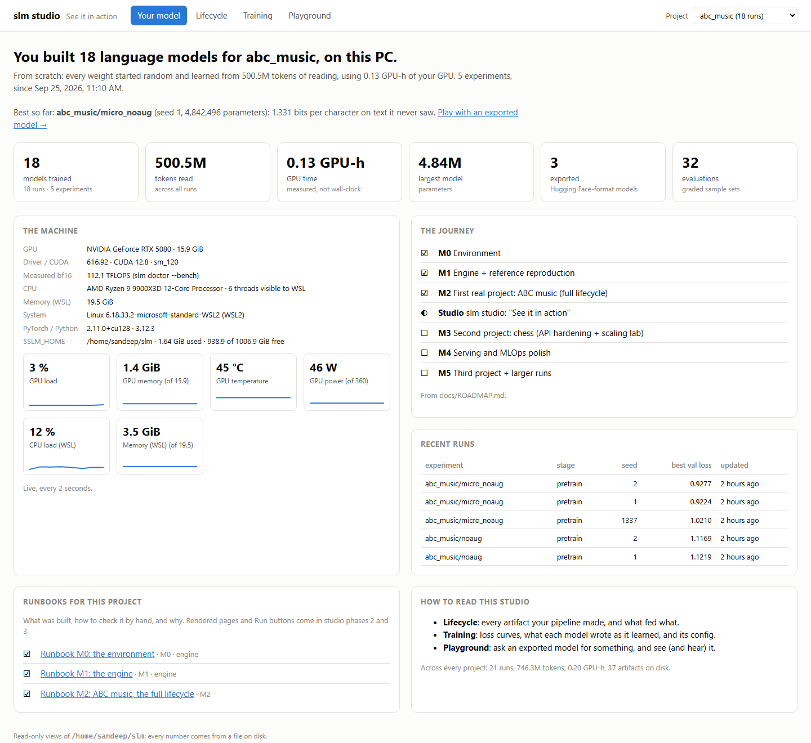
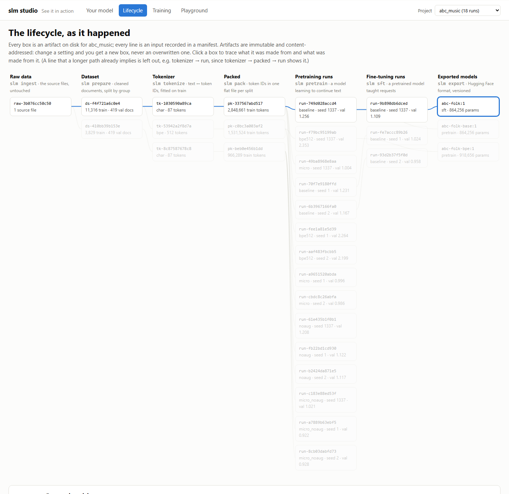
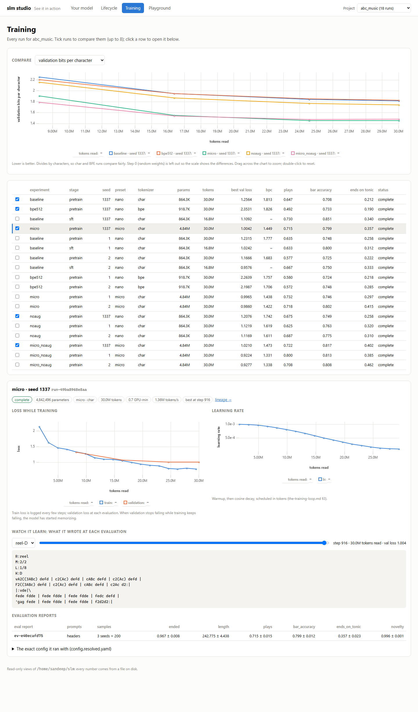
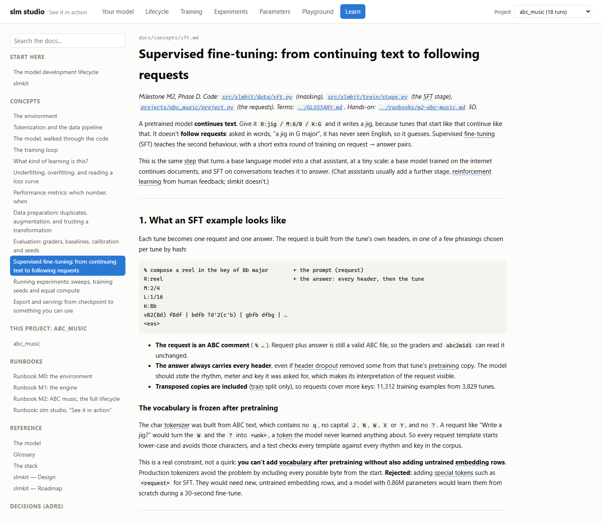
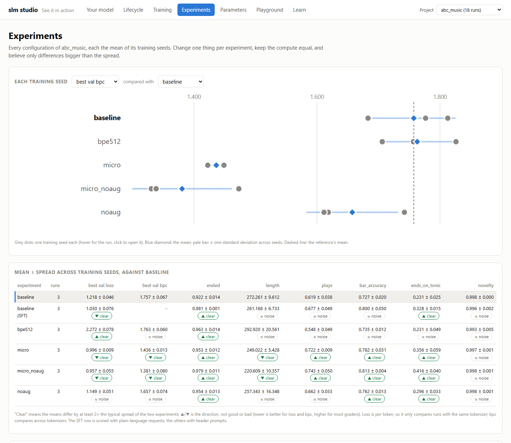
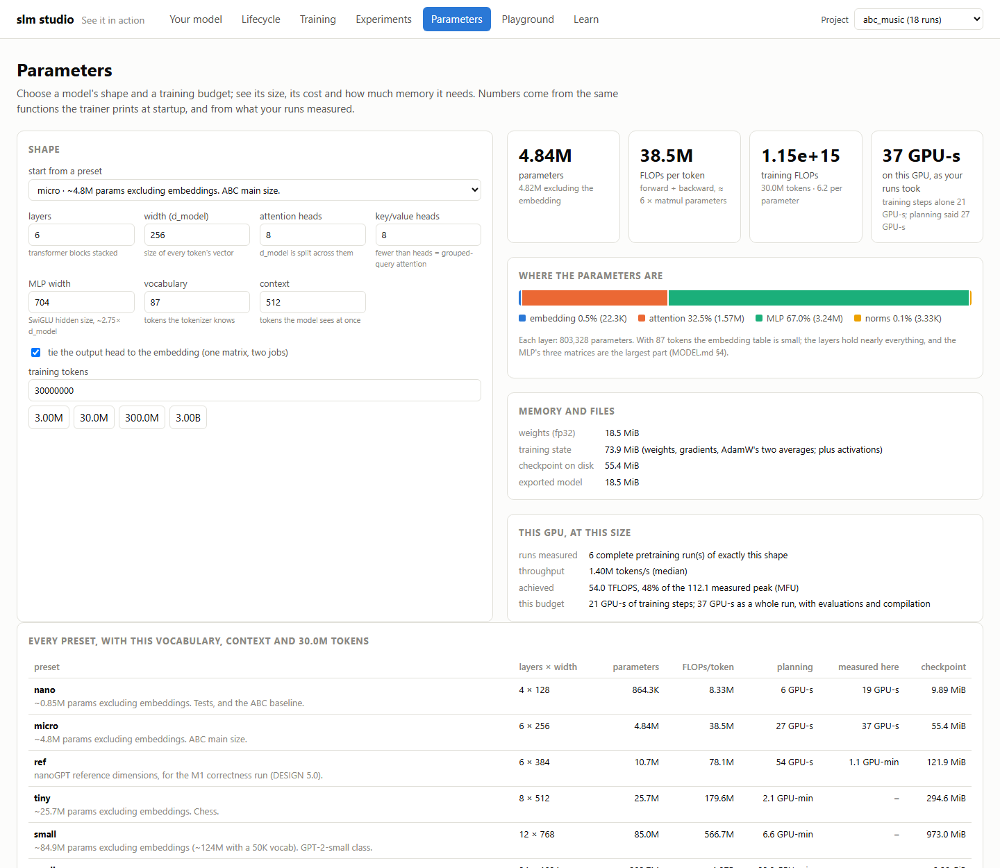

# Runbook: slm studio, "See it in action"

*What `slm studio` is, how to start, stop and check it, and what each page shows. Code:
[`src/slmkit/studio/`](../../src/slmkit/studio/). Decision:
[ADR 0009](../decisions/0009-slm-studio.md). Roadmap: the Studio section of
[`../ROADMAP.md`](../ROADMAP.md).*

| Phase | Builds | Status |
|---|---|---|
| **1** | start/stop/status/run; **Your model**, **Lifecycle**, **Training**, **Playground** | ☑ |
| **2** | **Learn** (rendered docs, glossary on hover), **Experiments**, **Parameters** | ☑ this page |
| 3 | **Verify**: runbook checks with Run buttons | ☐ |

The studio is a local web app over what is on disk: `$SLM_HOME`'s artifacts, runs, eval reports and
models, and the repo's roadmap and runbooks. It writes nothing except its own working set in
`$SLM_HOME/studio/`, trains nothing, and has one studio for every project, with a switcher.

---

## S.0 The checks

```bash
make test                                         # 213 passed
uv run pytest -q tests/unit/test_studio.py        # 18 passed
```

The tests start the studio's app on the toy project and check that:
- every API answers from disk;
- runbooks are matched to projects by their marker;
- documents outside `docs/` are refused;
- the playground is `slm serve`'s under a prefix, and path tricks (`ui/../manifest.json`) are refused;
- a tampered library download is rejected;
- a record left by a dead process is cleared;
- (phase 2) the doc tree follows the concepts index's order, glossary entries parse into the names they
  match, search is case-insensitive, `.git` and paths outside the repo are refused, and size estimates
  equal the trainer's own `parameters_from_args` and `flops_per_token`.

---

## S.1 Start, check, stop

```bash
uv run slm studio start          # starts in the background and opens your browser
uv run slm studio status
```
```
  vendor: uPlot 1.6.32 (MIT) -> /home/you/slm/studio/vendor/uPlot.iife.min.js
  vendor: uPlot 1.6.32 (MIT) -> /home/you/slm/studio/vendor/uPlot.min.css
slm studio is running: http://localhost:8765/  (pid 58620, log /home/you/slm/studio/studio.log)
slm studio is running: http://localhost:8765/  pid 58620, since 2026-09-30T14:47:55-05:00, health ok
  log: /home/you/slm/studio/studio.log
```

The `vendor:` lines appear on the first start only (and once more for each library a later phase adds:
marked, DOMPurify and Mermaid arrived with phase 2): the chart library is downloaded once,
checked against its pinned SHA-384 hash, and kept. After that the studio works offline (the
Playground's sheet music still loads abcjs from its CDN, E.6).

```bash
uv run slm studio stop
uv run slm studio status; echo "exit $?"
```
```
stopped slm studio (pid 58620)
slm studio is not running  (start it: uv run slm studio start)
exit 1
```

`status` exits 0 when the studio answers and 1 when it doesn't, so it can be scripted.
`slm studio run` is the same server in the foreground (Ctrl-C stops it), for tmux. `--port` picks
another port; `--no-open` skips the browser.

**What it leaves on disk, and where:**

```bash
ls ~/slm/studio ~/slm/studio/vendor
git status --short               # nothing: the studio never writes into the repo
```
```
/home/you/slm/studio:
studio.json  studio.log  vendor

/home/you/slm/studio/vendor:
uPlot.iife.min.js  uPlot.min.css
```

`studio.json` records the process ID and port. Deleting the folder loses nothing: the next start
rebuilds it.

**Why a background process is fine here** (CONTRIBUTING.md says "no daemons"): nothing depends on the studio
running and it holds no state. A power-off just ends it; `slm studio status` then clears the stale
record, and `start` begins again. It's a convenience you start and stop, not a job the machine must
keep alive.

---

## S.2 Your model



- **The headline and tiles:** models trained, tokens read, GPU-time, the largest model, exports and
  evaluations for the selected project. All of it is summed from `status.json` and manifests.
- **The machine:** GPU, driver, CUDA, the TFLOPS `slm doctor --bench` measured, CPU, memory and disk,
  plus live GPU load, memory, temperature and power, CPU and RAM, polled every 2 seconds. Start a run
  in another terminal and watch the GPU gauges move.
- **The journey:** the milestone headings of `docs/ROADMAP.md` and their status marks.
- **Runbooks for this project:** from `docs/runbooks/`, matched by the marker described in
  [`README.md`](README.md). Click one to read it; rendered pages come in phase 2.

**Check by hand:** the tile "models trained" should equal the number of complete rows for the
project in `uv run slm runs list`, and GPU time the sum of its GPU-h column.

---

## S.3 Lifecycle



One column per pipeline stage, one box per artifact on disk, one line per input recorded in a
manifest. Click a box (or open `#/lifecycle?project=abc_music&id=abc-folk:1`): its whole lineage
lights up, back to the raw data and forward to what was made from it, and the panel below shows its
manifest: config (what its ID hashes), stats and inputs.

Lines that a longer path already implies are left out (a *transitive reduction*): every run reads the
tokenizer directly, but tokenizer → packed → run already shows that. Lineage tracing still follows
every edge.

**Check by hand:** `uv run slm lineage abc-folk:1` walks the same chain the highlighted boxes show.

---

## S.4 Training



- **Compare:** tick up to 8 runs and chart validation loss, bits per character, or the train/val gap,
  against tokens read. Hover for values; drag to zoom; double-click to reset. Bits per character is
  the default because it compares char and BPE runs fairly. Runs trained before the trainer logged
  it get it computed with the same formula `slm runs summary` uses; SFT runs have none (their loss
  covers answers only) and the page says so.
- **The table:** every run, with the project's own grader columns from its latest eval report (for
  abc_music: plays, bar accuracy, ends on tonic). The columns come from the data, so chess's will be
  different.
- **One run in detail:** training and validation loss (the gap opening is memorization), the
  learning-rate schedule, **watch it learn** (a slider through what the model wrote at every
  evaluation, from random characters at step 0 to tunes), its eval reports, and its exact
  `config.resolved.yaml`.

**Check by hand:** a row's "best val loss" equals the lowest `val_loss` in that run's
`metrics.jsonl`; a run's bpc equals `slm runs summary`'s for the same run.

---

## S.5 Playground

Every exported model of the project as a card. Choosing one opens its playground: the same page and
the same code as `slm serve` (serving.md §8), served at `/play/<name>/<version>/`. Up to two models
stay loaded. An export made before its project had a viewer uses the project's current one from the
repo, and its card says so.

---

## S.6 Check every page without clicking

With the studio running, a real browser can render any page to an image from WSL:

```bash
"/mnt/c/Program Files/Google/Chrome/Application/chrome.exe" --headless=new --disable-gpu \
  --window-size=1440,1400 --virtual-time-budget=15000 --screenshot='C:\Users\Public\studio.png' \
  "http://localhost:8765/#/lifecycle?project=abc_music&id=abc-folk:1"
```

and open `C:\Users\Public\studio.png`. The screenshots on this page were made this way. Microsoft
Edge works the same (`/mnt/c/Program Files (x86)/Microsoft/Edge/Application/msedge.exe`).

**Framework check for M3:** switch the project to `shakespeare_char`. Every page works for a project
the studio was never written for: its runs, its lineage, curves that overfit (the M1 reference), and
"ROMEO:" in the samples. Chess will appear the same way.

---

## S.7 Learn



Every document in the repo, in reading order: start here, concepts (in the order milestones produced
them), this project's README, its runbooks, the reference docs and the ADRs. Each is rendered as
committed (`#/learn?doc=docs/concepts/sft.md`):

- **Links between documents stay in the studio**; links to source files open them in a viewer; images
  (the figures, the training GIF) are served from the repo.
- **Diagrams** (Mermaid, e.g. in The model development lifecycle) are drawn.
- **Glossary terms are underlined on first use.** Hover or focus one for its definition, with a link to
  the glossary entry. They are parsed from `GLOSSARY.md` (177 entries), so a new term there appears
  everywhere with no other change.
- **Search** (top left) looks through every document, case-insensitively, and links to the section.

**Check by hand:** open "Supervised fine-tuning", hover the dotted "header dropout", and compare the text
with the glossary's entry.

---

## S.8 Experiments



`slm runs summary` as a picture, with a verdict:

- **The dot plot:** each experiment's training seeds as dots, the mean as a diamond, ± one spread as a
  pale bar, the reference experiment's mean as a dashed line. Click a dot to open that run.
- **The table:** every metric as mean ± spread, and against the reference either **clear** (the means
  are at least 2× the typical spread apart) or **≈ noise**. Pick another reference: compare
  `micro_noaug` with `micro` and see transposition's effect turn out to be noise on bits per character.
- **Two kinds of noise:** for a grader metric, the sampling spread (one model, re-sampled: `slm eval`'s
  ±) next to the training spread (re-trained with another seed). The second is the larger, which is why
  Phase C's single-seed tokenizer gap didn't survive (experiments.md §3).

**Check by hand:** the means and spreads equal `uv run slm runs summary --project abc_music`.

---

## S.9 Parameters



Pick a preset or set the shape by hand (layers, width, heads, key/value heads, MLP width, vocabulary,
context) and a token budget, and see:

- **parameters**, split into embedding, attention, MLP and norms;
- **FLOPs per token** and **training FLOPs**;
- **memory and files**: fp32 weights, training state (weights, gradients and AdamW's averages, 16 bytes
  per parameter), checkpoint and export sizes;
- **what this GPU measured** for runs of exactly that shape: tokens per second, achieved TFLOPS and MFU
  against the `slm doctor --bench` peak, and the budget's GPU time as training steps alone and as whole
  runs (with evaluations and compilation). `micro`: 1.40M tokens/s, 54 TFLOPS, 48% MFU, and 37
  GPU-seconds for 30M tokens against 21 for the steps alone and 27 planned.

The arithmetic is the trainer's own (`parameters_from_args`, `flops_per_token_from_args`), on the
server; the page only displays it. An impossible shape (8 heads that don't divide the width) gets a
plain explanation instead of numbers.

**Check by hand:** the nano preset with vocabulary 87 shows 864,256 parameters, the number `slm
pretrain abc_music/baseline` prints at startup.

---

## Phase 1: done when

- [x] `make test` (205) and `make lint` pass.
- [x] `slm studio start | stop | status | run` work; nothing is written to the repo.
- [x] Your model, Lifecycle, Training and Playground render for `abc_music` and `shakespeare_char`.
- [ ] **You** have run S.1–S.6 in your browser.

## Phase 2: done when

- [x] `make test` (213) and `make lint` pass.
- [x] Learn renders every doc with diagrams, in-studio links, images and glossary hovers (30 terms
      annotated in sft.md; no scripts or event handlers in rendered HTML).
- [x] Experiments and Parameters agree with `slm runs summary` and with the trainer's startup numbers.
- [ ] **You** have run S.7–S.9 in your browser.
